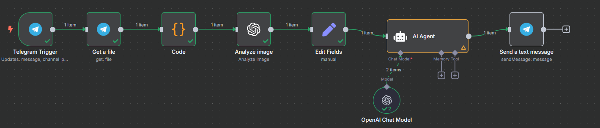
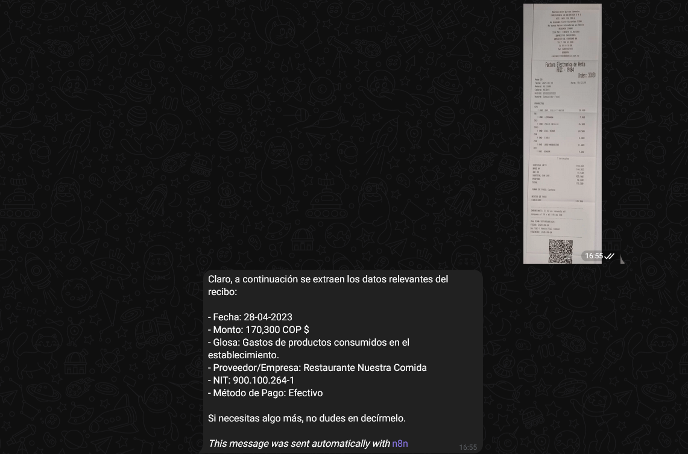

# 🧾 Luzia Bot – Asistente Financiera en Telegram con n8n

Este proyecto implementa un **workflow de n8n** que actúa como un asistente financiero inteligente llamado **Luzia**. Recibe imágenes de recibos o boletas a través de **Telegram**, extrae la información clave utilizando **IA (GPT-4o)** y responde automáticamente con un resumen del gasto.

---

## 🚀 Funcionalidades

- 📸 Recibe imágenes de recibos enviadas por Telegram.
- 🧠 Analiza el contenido usando un modelo GPT-4o de OpenAI.
- 📬 Responde al usuario con un mensaje estructurado en Telegram.
- 🔒 Ignora detalles irrelevantes y se enfoca solo en los datos clave (fecha, monto, comercio, método de pago, etc.).

> ⚠️ Actualmente, el flujo **no guarda los datos en Google Sheets**. La funcionalidad está centrada únicamente en el análisis y la respuesta por mensaje.

---

## 📂 Contenido del Repositorio

- `workflow-gastos-telegram.json`: Archivo exportado desde n8n con el flujo completo.
- (Opcional) `README.md`: Este archivo con toda la documentación.

---

## 📦 Requisitos

- Cuenta de **Telegram Bot** (creado con BotFather)
- Cuenta de **OpenAI** con acceso a GPT-4o
- Instancia funcional de **n8n**
- (Opcional) Cuenta de Google para integración con Sheets (desactivado en esta versión)

---

## 🔧 Cómo importar el workflow

1. Ingresá a tu instancia de [n8n](https://n8n.io).
2. Hacé clic en **Import → From File**.
3. Seleccioná el archivo `workflow-gastos-telegram.json`.
4. Configurá las credenciales de:
   - Telegram API
   - OpenAI (GPT-4o)
5. Activá el flujo y ¡listo!

---

## 💡 Ideas futuras

- Guardar automáticamente los datos en Google Sheets.
- Permitir audio o PDF como entrada.
- Agregar análisis de sentimiento del gasto (¿fue útil o impulsivo?).
- Generar reportes mensuales automatizados.

---

## 🧠 Autor

Creado por Tomás Zapani

---
## Flujo

## Resultados

## 📜 Licencia

Este proyecto está disponible bajo la licencia MIT.
